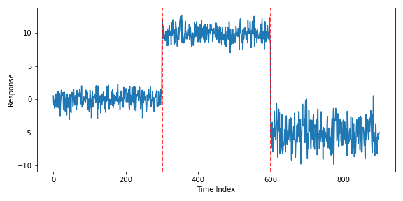
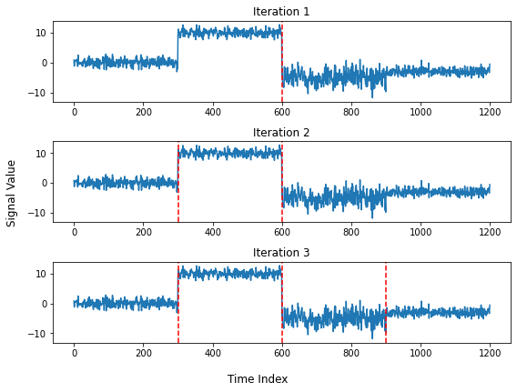

# About change point detection

## What is it?

Change point detection is a subfield of signal process and time series analysis that's concerned with detecting structural changes in a signal. More simply, we want to detect when a signal has changed significantly. The points where the signal has changed are refered to as **change points**. What a "change" means depends on what we care about in the signal, usually this is the mean and/or variance of the noise distribution of the signal.  Shown below is an example of an artifial time series drawn from a random normal distribution with two change points (denoted by the dashed red lines).

## Offline vs Online

Like other areas of machine learning, change point detection usually comes in offline and online forms. In the offline case, we consider our dataset fixed and only perform the segmentation of the segmentation once. Offline change point is much faster, but should the signal change, we would have to start over. Online methods are able to update as new data comes in, but usually at the cost of exactness and efficiency. Fastchange currently only implements offline detection, but could be expanded to include online methods.

## Components of change point detection

There are three major components of most offline change point detection algorithms, which we will go over in the sections below.

## Segmentation algorithm

To identify where change points (of which there could be multiple) are in a signal, we need a method to search all potential locations in an efficient manner. These are known as segmentation algorithms. Shown below is an example of binary segmentation, a fast, approximate method for finding multiple change points, segmenting a signal over three iterations:

## Segment cost

The second major component is the cost function, which tells us how how homogeneous a given subsignal of our signal is. Usually this takes the form of maximum likelihood estimation of location and/or scale parameters of exponential family distributions, like the normal distribution. The segmentation method in the previous section discovers change points by trying to minimize the sum of the segment costs of a signal.

## Complexity penalty

The last component of our model, penalty functions penalize the complexity of the model. Without some sort of cost to additional change points, our model would want to separate the signal into as many change points as there are observations. To fix this, we add an information criterion (usually MBIC, BIC, or AIC) thats a function of the number of change points discovered to the segment cost from the previous section. The lower the penalty, the more change points the segmenter will find, and the higher penalty, the fewer change points discovered.